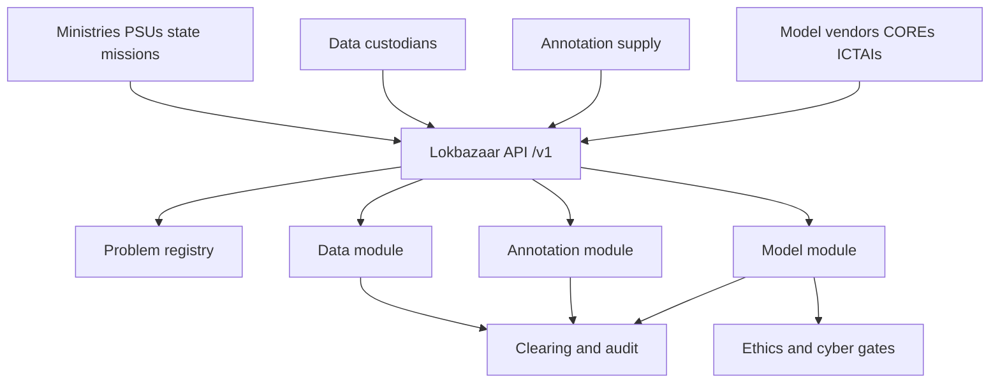

# Lokbazaar

**Source:** `ai-in-gov/NationalStrategy-for-AI-Discussion-Paper/`
**Domain:** `ai-gov`
**One-liner:** Lokbazaar is India’s three-module National AI Marketplace — data, annotation, and deployable models — so #AIforAll sectors can discover price and quality for training assets and solutions instead of relying on informal oligopoly contracts.
**Wedge:** NITI Aayog–sponsored marketplace operators and the first buyer cohort of central ministries, PSUs, and state departments with live problems in healthcare, agriculture, education, smart cities, and smart mobility — using public problem statements to seed supply from startups, COREs, and ICTAIs.
**Positioning:** The operating layer for NITI Aayog’s proposed National AI Marketplace (NAIM). The discussion paper’s #AIforAll strategy argues India should optimise social goods rather than topline growth alone, build COREs and ICTAIs for research-to-application flow, and unblock adoption through a formal marketplace that discovers both price and approach across data, annotation, and models. Lokbazaar is that marketplace productised — with traceability, annotation quality standards, and ethics/privacy gates — not another research portal.

## Market research synthesis

### Thesis from source

NITI Aayog’s discussion paper, mandated after the 2018–19 Budget speech calling for a National Program on AI, brands India’s path as #AIforAll: inclusive technology leadership, late-mover advantage through adaptation, and India as a “Garage” for emerging economies. Five focus sectors carry the greatest social externalities: healthcare (access and affordability), agriculture (income, productivity, wastage), education (access and quality), smart cities and infrastructure, and smart mobility and transportation. Barriers named explicitly include thin research expertise, absent enabling data ecosystems, high resource cost and low awareness, privacy/security and weak anonymisation rules, and lack of collaborative adoption.

On research, the paper proposes Centres of Research Excellence (COREs) for core knowledge (order-of-magnitude funding cited around INR 50–100 crore per CORE) and International Centers of Transformational AI (ICTAIs) as industry-led application hubs under an “ICTAI Inc.” society/section-8 structure, with moonshots and a possible “CERN for AI” framing. Ethics follow a FAT (Fairness, Accountability, Transparency) consortium of ethics councils at COREs.

On adoption, the distinctive instrument is the marketplace model. Informal data markets favour incumbents who can negotiate one-off contracts and run specialised departments; information asymmetry blocks fair price discovery. NAIM is proposed as three modules: (a) data marketplace, (b) data annotation marketplace, and (c) deployable model / solutions marketplace. The paper prefers a decentralised data marketplace with traceability and audit trails against resale over a single central host that custodians will not trust; annotation is framed as both an ai-supply bottleneck and a large employment absorber; the solutions marketplace needs continuous quality scrutiny, trial access, and government/PSU demand as the initial network seed. Government should enable regulations (personal data sale permissions, anonymisation standards, annotation accuracy, cybersecurity for models) and may stand up an initial platform while allowing competing operators.

Lokbazaar is the shippable commercialisation of that three-module marketplace with public-sector demand as the cold-start engine.

### Buyer & economic model

- Primary buyer: the marketplace operating entity authorised under the National Program on AI (public–private platform company or designated agency); economic buyers of listings are ministry/PSU digital leaders and state mission directors in the five focus sectors.
- Users: data custodians (hospitals, agri boards, urban bodies); annotation enterprises and individual annotators; model vendors and startups; CORE/ICTAI researchers; procurement and security officers; ethics/privacy reviewers.
- Budget owner / value metric: platform take-rate on cleared transactions plus public programme spend that currently leaks into opaque data brokerage. Value metric is time-to-dataset and time-to-trial-model for a published government problem, and share of transactions with full provenance and quality attestation.
- Competing status quo: informal bilateral data deals; captive annotation vendors; bespoke SI contracts with no trial access; research MoUs that never become deployable artefacts; global cloud model catalogues that ignore Indian sector data and language contexts.

### Domain constraints

- Regulatory / trust / safety: personal data permissions, anonymisation standards, FAT ethics for models touching healthcare and welfare, cybersecurity for deployable models, IP facilitation for ai-specific patent issues raised in the paper.
- Data sensitivity: health, farmer, student, and mobility data cannot be freely pooled; Lokbazaar must support custodial control, purpose limitation, and traceable licensed access rather than dumping raw datasets into a central lake.
- Change-management realities: custodians fear loss of control and resale; startups fear incumbent bias in quality ratings; government buyers need procurement-compatible trial paths. The marketplace must work with partial listings and improve through iteration, as the paper notes there is little precedent.

## Business requirements

- BR-1: The platform must operate three distinct modules — data, annotation, and deployable models — with separate listing types, quality rules, and clearing events, while sharing a common participant identity and problem registry.
- BR-2: Every data listing carries provenance, licence terms, anonymisation status, and an audit trail that records access and forbids undetected resale.
- BR-3: Annotation jobs publish accuracy standards and sampling QA results; jobs that miss the standard cannot clear payment without a documented waiver.
- BR-4: Model listings must offer trial-based access before full procurement, so buyers can iterate as the paper requires for marketplace feature discovery.
- BR-5: Government and PSU problem statements in the five #AIforAll sectors can seed the demand side and must be linkable to resulting listings and awards for public accountability.
- BR-6: CORE and ICTAI outputs can be listed with research provenance, distinguishing core-research artefacts from application-ready models.
- BR-7: Personal data listings require a recorded lawful basis and purpose limitation; listings lacking them are refused.
- BR-8: Continuous quality monitoring covers sellers, buyers, and artefacts; repeated failure triggers suspension, not only a low star rating.
- BR-9: Price discovery is visible at module level (data licence, annotation unit, model subscription/licence) so informal oligopoly pricing has a public comparator.
- BR-10: Ethics review hooks (FAT checks) are mandatory for models in healthcare, education, and welfare-adjacent uses before they are marked procurement-ready.
- BR-11: Cybersecurity attestation is required for deployable model packages before production clearance.
- BR-12: The platform must allow multiple marketplace operators under common regulatory standards, reflecting the paper’s stance that government enables and may seed but should not permanently monopolise the market.

## User stories

Canonical user stories live in sibling [USER_STORIES.md](USER_STORIES.md).

## System design

### Overview

Lokbazaar is a three-module marketplace with a shared participant and problem layer. Custodians list data with licence and anonymisation metadata; buyers commission annotation with QA gates; vendors list models with trial access and ethics/cyber attestations. Public-sector problems seed demand. Clearing produces provenance-rich transactions suitable for audit and procurement files.

### Actors & boundaries

- Actors: marketplace operator; government/PSU buyers; data custodians; annotators; model vendors; CORE/ICTAI labs; ethics and security reviewers.
- Trust boundary: raw personal data stays with custodians or approved processing environments; the marketplace exchanges licences, pointers, attestations, and trial endpoints. Resale detection relies on access audit trails and contractual remedies.
- Human-in-the-loop points: ethics FAT reviews; cybersecurity attestation; suspension decisions; waivers on failed annotation QA; acceptance of trial results into procurement.

### Core capabilities

1. **Participant and problem registry** — identities across modules; #AIforAll sector problem statements.
2. **Data marketplace** — listings, licences, provenance, anonymisation status, access audit.
3. **Annotation marketplace** — jobs, accuracy standards, QA sampling, payment clearance.
4. **Model / solutions marketplace** — listings, trial access, quality monitoring, procurement-ready flags.
5. **Research provenance** — CORE/ICTAI artefact linkage.
6. **Ethics and security gates** — FAT reviews and cyber attestations.
7. **Clearing and price discovery** — transactions, fees, benchmarks.
8. **Enforcement** — suspensions, resale incident records.
9. **Multi-operator standards profile** — shared regulatory metadata for competing exchanges.

### Conceptual data

- Primary entities: Participant, SectorProblem, DataListing, DataLicence, AccessAuditEvent, AnnotationJob, AnnotationQaSample, ModelListing, ModelTrial, EthicsReview, CyberAttestation, Transaction, SuspensionRecord, ResearchArtefact.
- Critical events: problem published; listing created; licence granted; access logged; annotation QA passed/failed; trial started/completed; ethics cleared; transaction cleared; seller suspended.
- Retention / audit needs: access audits and transactions retained for statutory and procurement audit windows; personal data pointers follow custodian retention; ethics decisions append-only.

### Integrations (conceptual)

- Systems of record: ministry programme systems; PSU ERP/procurement; hospital/agri/urban data custodians; CORE/ICTAI repositories; payment rails.
- Upstream signals: National Program on AI priorities; sector regulators’ anonymisation rules; language and skill taxonomies for annotation labour.
- Downstream actions: procurement awards; research-to-application handoffs; public marketplace benchmark reports; employment programme targeting for annotation work.

### High-level architecture

### Success metrics

- Leading: number of live listings per module; median time from problem publish to first trial; share of data accesses with complete audit trails; annotation QA pass rate.
- Lagging: reduction in informal bilateral data deals for participating ministries; successful procurements originating from trials; annotation jobs delivered in priority regions; repeat seller suspension rate trending down as quality rises.

## OpenAPI skeleton

Canonical HTTP surface lives in sibling [openapi.yaml](openapi.yaml). Summary:

- **Base path:** `/v1/...`
- **Auth:** `X-API-Key` for custodian and model serving integrations; Bearer JWT for operators and buyers.
- **Resource groups:** Problems, DataListings, AnnotationJobs, ModelListings, Trials, Reviews, Transactions.
