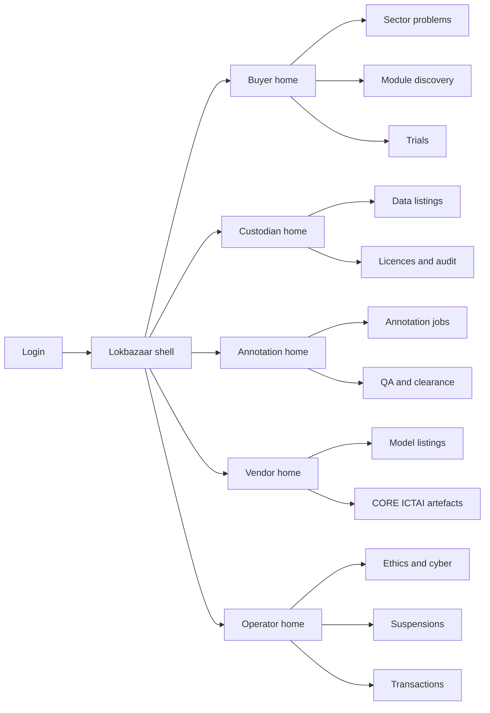
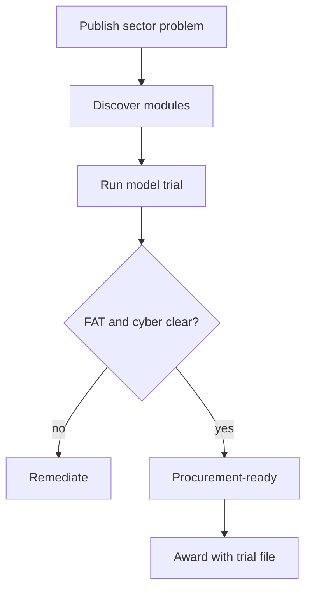
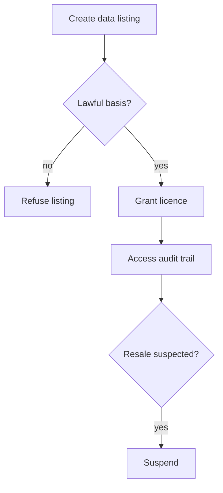

# Lokbazaar — Web app

**Product:** [PRODUCT.md](./PRODUCT.md)
**Primary surface:** Three-module National AI Marketplace console (buyer, custodian, annotator, vendor, and operator workspaces under one Lokbazaar shell)
**Secondary surfaces:** Public price-discovery boards (module-level benchmarks); problem statement public page (read-only accountability)
**Design thesis:** Lokbazaar is a bazaar for training assets and solutions — not a research portal and not a cloud model catalogue. The metaphor is a three-aisle mandi with seals: data licences with resale-audit trails, annotation jobs with published accuracy bars, and models that must be trialable before procurement. Visual language is deep indigo and marigold (India stack gravity without tourism kitsch), chalk-white panels, and stamp-green for cleared transactions. The Lokbazaar wordmark sits as a quiet seal on every clearing and problem screen so ministries know which marketplace operator cleared the deal under common standards.

## UX research synthesis

### Category peers (best-in-class)

- **GeM (Government e-Marketplace, India):** Public-sector demand seeding, comparable quotes, procurement-compatible trails. Steal: problem-to-award linkage and buyer price benchmarks; reject commodity SKU UX for datasets that need purpose limitation.
- **AWS Marketplace / Azure Marketplace:** Trial → subscribe → procure for solutions; seller attestation. Steal: trial-before-buy and attestation gates; reject global model aisles that ignore Indian sector/language context and custodial data control.
- **Hugging Face Hub:** Discoverability of models with cards, licences, and demo spaces. Steal: model cards and trial endpoints; reject unconstrained download culture for personal-data-adjacent artefacts.
- **Scale AI / annotation ops consoles:** Job specs, accuracy thresholds, sampled QA, payment holds. Steal: QA-gated payment clearance; reject gig-app gamification aesthetics that undermine #AIforAll employment dignity.

### Patterns to adopt / reject

- **Adopt:** Three distinct modules sharing identity and problem registry; provenance + anonymisation on every data listing; access audit against resale; annotation QA bar before pay; mandatory trials; #AIforAll sector problem seeding; CORE vs ICTAI provenance labels; FAT + cyber gates before procurement-ready; multi-operator standards profile; suspension after repeated failure.
- **Reject:** Single lake “upload dataset”; star ratings as sole quality; informal chat deals as primary path; opaque SI private networks; purple AI glow; card walls of five sectors without price or QA.

### Trust, density, and workflow constraints from PRODUCT.md

Raw personal data stays with custodians; marketplace holds licences, pointers, attestations (BR-2, BR-7). Healthcare/education/welfare models need FAT before procurement-ready (BR-10). Cyber attestation before production clearance (BR-11). Custodians fear resale; startups fear incumbent-biased ratings — rules must be published (BR-8). Multiple operators under common standards (BR-12).

## Information architecture

### Nav model

### Roles → default home

| Role | Default home | Why |
|------|--------------|-----|
| Ministry / PSU problem owner | Sector problems | Seed demand (BR-5) |
| Procurement officer | Trials + award linkage | Evidence before buy (BR-4) |
| Data custodian | Data listings | Provenance and lawful basis (BR-2, BR-7) |
| Annotation lead | Annotation jobs | Accuracy standards (BR-3) |
| Model vendor / startup | Model listings | Trialable discovery (BR-4, BR-9) |
| CORE / ICTAI researcher | Research artefacts | Provenance path (BR-6) |
| Ethics / cyber officer | Reviews queue | FAT and attestation (BR-10, BR-11) |
| Marketplace operator | Transactions + suspensions | Quality enforcement (BR-8, BR-12) |

### Cross-links to OpenAPI resources

| Nav area | OpenAPI tags / resources |
|----------|---------------------------|
| Sector problems | Problems |
| Data listings / licences | DataListings |
| Annotation jobs / QA | AnnotationJobs |
| Model listings | ModelListings |
| Trials | Trials |
| Ethics / cyber reviews | Reviews |
| Clearing / benchmarks | Transactions |

## Screen inventory

### Buyer home

- **Purpose:** Answer “for my live sector problem, what data, annotation capacity, and trialable models exist at what price?”
- **Entry:** Ministry/PSU login default.
- **Layout regions:** Brand + operator badge; active problems; module price strip (data/annotation/model); linked listings; trial results awaiting procurement file.
- **Primary actions:** Publish problem; open trial; compare prices; attach trial to award draft.
- **Empty / loading / error:** Empty = publish first #AIforAll problem wizard.
- **BR / story ties:** BR-1, BR-5, BR-9.

### Sector problem registry

- **Purpose:** Public-sector problem statements seed demand and link to listings/awards for accountability.
- **Entry:** Buyer nav; public secondary page.
- **Layout regions:** Problem list by five sectors; linked artefacts; award outcomes; accountability timeline.
- **Primary actions:** Create problem; link listing; publish award outcome.
- **Empty / loading / error:** Empty sector = invite CORE/ICTAI and startups CTA.
- **BR / story ties:** BR-5.

### Data listing editor and browse

- **Purpose:** Licence datasets with provenance, anonymisation, lawful basis, purpose limitation — refuse incomplete personal-data listings.
- **Entry:** Custodian create; buyer discover → Data aisle.
- **Layout regions:** Listing detail (provenance, licence, anonymisation stamp); lawful-basis gate; price; access request; audit trail preview.
- **Primary actions:** Publish listing; request licence; view audit; refuse incomplete personal data.
- **Empty / loading / error:** Missing lawful basis = hard refuse; error = sync with custodian environment.
- **BR / story ties:** BR-2, BR-7.

### Access audit and resale incidents

- **Purpose:** Record access; surface suspected resale; contractual remedies path.
- **Entry:** Custodian licences; operator enforcement.
- **Layout regions:** Access event ledger; anomaly flags; incident case; suspension link.
- **Primary actions:** Open incident; suspend participant; export audit for counsel.
- **Empty / loading / error:** Empty = healthy access pattern message.
- **BR / story ties:** BR-2, BR-8.

### Annotation job board

- **Purpose:** Jobs with published accuracy standards, language/skill tags, sampled QA, payment clearance.
- **Entry:** Annotation home; buyer commission.
- **Layout regions:** Job table; accuracy bar; QA sample results; payment hold state; regional skill demand view.
- **Primary actions:** Create job; submit QA sample; clear payment; document waiver on fail.
- **Empty / loading / error:** QA fail without waiver blocks clearance.
- **BR / story ties:** BR-3; employment absorber framing.

### Model listing and trial desk

- **Purpose:** List models with trial access; sector tags; CORE vs application-ready labels.
- **Entry:** Vendor home; buyer Models aisle.
- **Layout regions:** Model card; trial endpoint status; research provenance; price; FAT/cyber gate stamps; procurement-ready flag.
- **Primary actions:** Start trial; complete trial report; request procurement-ready; list artefact.
- **Empty / loading / error:** No trial endpoint = cannot mark procurement-ready.
- **BR / story ties:** BR-4, BR-6, BR-9.

### Ethics FAT and cyber attestation

- **Purpose:** Mandatory reviews for healthcare/education/welfare-adjacent models; cyber before production clearance.
- **Entry:** Ops Reviews; blocked from procurement-ready.
- **Layout regions:** Review queue; FAT checklist; cyber attestation package; pass/fail with reasons.
- **Primary actions:** Clear; reject; request remediation.
- **Empty / loading / error:** Failed gate removes procurement-ready.
- **BR / story ties:** BR-10, BR-11.

### Transaction clearing and price boards

- **Purpose:** Module-level price discovery and cleared deals with take-rate transparency.
- **Entry:** Ops; buyer benchmarks secondary.
- **Layout regions:** Clearing table; benchmark charts by module; operator id (multi-operator); fee line.
- **Primary actions:** Clear transaction; export benchmark; dispute clearance.
- **Empty / loading / error:** Empty module = “insufficient clears for benchmark”.
- **BR / story ties:** BR-9, BR-12.

### Suspension and quality enforcement

- **Purpose:** Repeated QA/ethics/cyber failure → suspension, not only low stars.
- **Entry:** Ops home.
- **Layout regions:** Failure history; published rules; suspension control; reinstatement dual control.
- **Primary actions:** Suspend; notify counterparties; reinstate.
- **Empty / loading / error:** Empty = no active suspensions.
- **BR / story ties:** BR-8.

### Multi-operator standards profile

- **Purpose:** Competing marketplace operators under common regulatory metadata.
- **Entry:** Operator admin; regulator view.
- **Layout regions:** Standards checklist; operator compliance status; cross-operator participant identity notes.
- **Primary actions:** Attest compliance; view peer operators.
- **Empty / loading / error:** Non-compliant operator cannot clear regulated categories.
- **BR / story ties:** BR-12.

## Key flows

1. **Problem to trial to award** — publish problem → discover listings → trial model → attach results → procurement path; failure: missing FAT/cyber blocks procurement-ready.

2. **Data licence with audit** — list with lawful basis → grant licence → access events → resale incident if needed.

3. **Annotation QA clearance** — job → sample QA → pass/pay or fail/waiver.

4. **CORE to ICTAI listing** — research artefact → provenance → application listing linked to problem.

5. **Operator suspension** — repeated failures → publish rule match → suspend across modules.

## Design system

### Tokens (CSS variables)

- `--color-ink: #1A1A1A` — primary text
- `--color-ground: #F3F0E8` — warm-neutral ground (avoid cream-serif-terracotta cliché; no terracotta accent)
- `--color-panel: #FFFFFF`
- `--color-indigo: #1B2A4A` — nav / #AIforAll gravity
- `--color-marigold: #E0A100` — price discovery / attention (not purple)
- `--color-stamp: #1F7A4C` — cleared transaction / QA pass
- `--color-coral: #C44B3C` — suspension / QA fail
- `--color-steel: #5C6670` — secondary
- `--color-brand: #C45C26` — restrained saffron-adjacent brand (not tourism orange flood)
- `--font-display: "Literata", serif` — problem titles and bazaar headings
- `--font-body: "IBM Plex Sans", sans-serif`
- `--font-mono: "IBM Plex Mono", monospace` — licence ids, audit hashes
- `--space-1`…`--space-8`: 4px scale
- `--radius-sm: 4px`; `--radius-md: 8px`
- `--motion-clear: 160ms ease-out` — stamp on clear
- `--motion-trial: 240ms ease-in-out` — trial progress
- `--motion-suspend: 200ms ease-in-out` — coral pulse
- Atmosphere: subtle modular “aisle” vertical rules separating three modules; chalk texture on price boards; no stock startup collage heroes.

### Typography & brand

- Literata for problem and listing titles; Plex for UI; mono for audits.
- Brand seal on clearing, problem, and procurement-ready screens.
- Login: brand hero; headline (“Price and quality, three aisles”); one CTA.

### Do / don’t

- **Do:** Keep three modules visually distinct; show price comparators; gate personal data; require trial before procurement-ready; publish suspension rules.
- **Don’t:** Central data lake dump; star-only quality; purple AI; emoji sector icons as navigation; hide operator identity on clears.

### Accessibility & domain trust cues

- Marigold/coral never sole status — text labels for QA/suspension.
- Live regions for QA fail and suspension.
- Focus: problem → listing → trial/QA → clear.
- Audit trails keyboard-navigable and exportable.

## Component patterns

- **ModuleAisleSwitch** — Data / Annotation / Models.
- **SectorProblemCard** — interactive problem container linking artefacts.
- **ProvenanceLicencePanel** — provenance, anonymisation, lawful basis.
- **AccessAuditLedger** — append-only access events.
- **AnnotationQaBar** — published accuracy + sample results + payment hold.
- **ModelTrialDesk** — start/complete trial with results file.
- **FatCyberGateStamp** — procurement-ready prerequisites.
- **PriceDiscoveryBoard** — module benchmarks.
- **SuspensionBanner** — cross-module enforcement.
- **OperatorStandardsBadge** — multi-operator compliance.

## Out of scope for v1 web

- Hosting raw health/farmer/student datasets centrally; full GeM replacement for all goods; annotator mobile gig app beyond job board; training IDE; patent prosecution suite; exclusive single-operator national monopoly UI.
